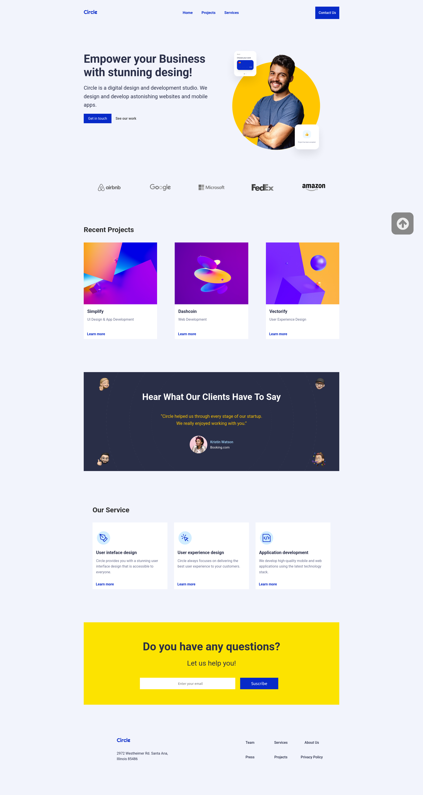
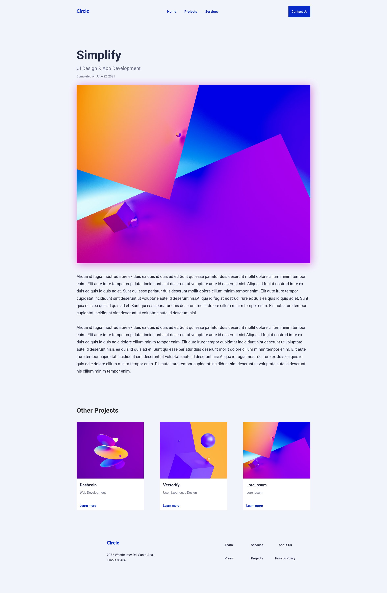

# Ironhack_DWEB_Final_Project_M1
Build and deploy first fully responsive website using the technologies we have learned so far: HTML, CSS and JavaScript. Final project Module 1.

# Circle Agency - Projects Page

Página de proyectos desarrollada como parte del proyecto web para la agencia ficticia "Circle Agency".

## 🚀 Tecnologías utilizadas

- **HTML** para la estructura del contenido.
- **CSS** para los estilos visuales.
- **JavaScript (vanilla)** para simular la carga dinámica de contenido.
- **Figma** para tener un diseño predefinido sobre el que podamos trabajar.
- **Git & GitHub** para control de versiones.
- **Netlify** para despliegue del proyecto.
- **Google Fonts (Roboto)** para implementar la fuente que se nos proporcionaba.

## 🔧 Estructuración del proyecto
└── ./
    ├── components
    │   ├── footer.html
    │   └── header.html
    ├── css
    │   ├── responsive.css
    │   └── style.css
    ├── js
    │   ├── components.js
    │   ├── contact.js
    │   ├── main.js
    │   ├── menu-hamburger.js
    │   └── projects.js
    ├── contact.html
    ├── index.html
    └── projects.html

## ❗ Dificultades enfrentadas

- **Organización en componentes**: entender cómo separar el código de forma limpia aunque y sin usar frameworks.
- **Preparación para contenido dinámico**: aunque no hay backend, se ha planteado la carga de proyectos vía `fetch`.
- **Implementación del responsive**: adaptar la estructura del layout sin romper la jerarquía de estilos.

## 🖼️ Imágenes del proyecto

## 🌍 Enlaces

- **Deploy del proyecto**: [Circle Agency](https://magical-khapse-f1ddfd.netlify.app/)
