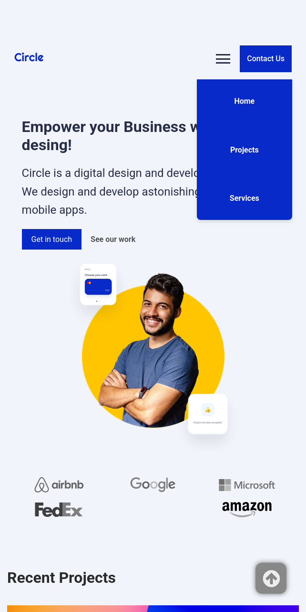

# Ironhack_DWEB_Final_Project_M1
Build and deploy first fully responsive website using the technologies we have learned so far: HTML, CSS and JavaScript. Final project Module 1.

# Circle Agency - Projects Page

Página de proyectos desarrollada como parte del proyecto web para la agencia ficticia "Circle Agency".

## 🚀 Tecnologías utilizadas

- **HTML5** para la estructura del contenido.
- **CSS3** para los estilos visuales, utilizando variables, diseño responsive y organización por componentes.
- **JavaScript (vanilla)** para simular la carga dinámica de contenido (fetch futuro).
- **Google Fonts (Roboto)** para mantener la coherencia tipográfica con el diseño original en Figma.

## 🔧 Estructuración del proyecto

## ❗ Dificultades enfrentadas

- **Implementación del responsive**: adaptar la estructura del layout sin romper la jerarquía de estilos.
- **Organización en componentes**: entender cómo separar el código de forma limpia aunque y sin usar frameworks.
- **Preparación para contenido dinámico**: aunque no hay backend, se ha planteado la carga de proyectos vía `fetch`.

## 🖼️ Imágenes del proyecto

## 🌍 Enlaces

- **Deploy del proyecto**: [Circle Agency](https://magical-khapse-f1ddfd.netlify.app/)
